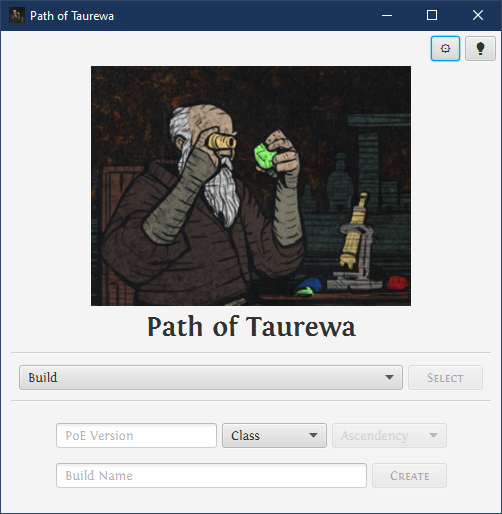
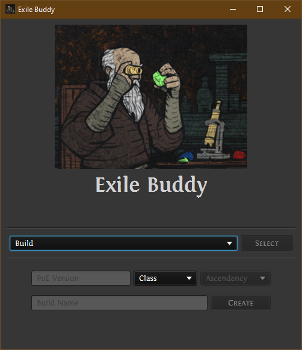

# Path of Taurewa
[](https://github.com/Buried-In-Code/Path-of-Taurewa/releases)
[](https://github.com/Buried-In-Code/Path-of-Taurewa/issues)
[](https://github.com/Buried-In-Code/Path-of-Taurewa/graphs/contributors)
[](https://opensource.org/licenses/MIT)

Simplified view of what gems, items and build details to use for your Path of Exile character.

## Built Using
- [AdoptOpenJDK: 11](https://adoptopenjdk.net/)
- [Gradle: 7.0.2](https://gradle.org/)
- [kotlin-stdlib-jdk8: 1.5.10](https://kotlinlang.org/)
- [kotlinx-serialization-json: 1.2.1](https://github.com/Kotlin/kotlinx.serialization)
- [kaml: 0.34.0](https://github.com/charleskorn/kaml)
- [tornadofx: 2.0.0-SNAPSHOT](https://github.com/edvin/tornadofx)
- [log4j-api: 2.14.1](https://logging.apache.org/log4j/2.x/)
- [log4j-core: 2.14.1 (Runtime)](https://logging.apache.org/log4j/2.x/)

## Execution
**From Source:**
```bash
$ ./gradlew clean run
```
**From Release:**
1. Run the file `bin/Path-of-Taurewa.bat`

## Screenshots
<details>
  <summary>Selection Screen</summary>
  
  
  <br /><br /><br /><br /><br /><br /><br /><br /><br /><br /><br /><br /><br /><br />
</details>

## Socials
[](https://discord.gg/nqGMeGg)
